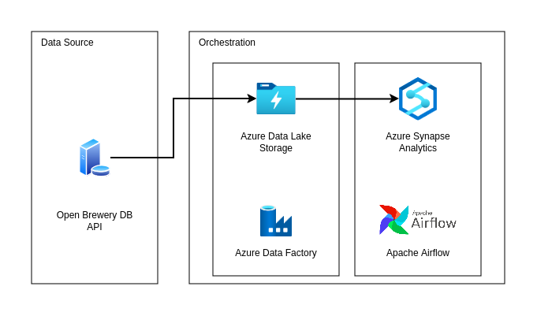

# BEES

## Objective
The goal of this project is to create a pipeline consuming data from an API, transforming and persisting it into a data lake following the medallion architecture with three layers: raw data, curated data partitioned by location, and an analytical aggregated layer.

## Requisites
To run this project it is necessary to run it on Bash. To do that is needed:
- Terraform Authentication on Azure;
- Service principal;
- Specify service principal credentials in environment variables.

Documentation to help in this process is available on [this page](https://learn.microsoft.com/en-us/azure/developer/terraform/get-started-cloud-shell-bash?tabs=bash) 

## Architecture

The architecture was chosen thinking on the details and needs for the pipeline:
1. API: It will use the Open Brewery DB API to fetch data. The API has an endpoint for listing breweries [here](https://api.openbrewerydb.org/breweries)
2. Orchestration Tool: Two orchestration tools will be used in this project: Azure DataFactory for extracting data from the API and saving in a file and Airflow to ingest the file and create other layers.
3. Language: The main language for this project is going to be Python.
4. Containerization: Airflow is going to be deployed in the “Web App for Containers” tool on Azure.
5. Data Lake Architecture: The data lake will follow the medallion architecture having a bronze,
silver, and gold layer:
    1. Bronze Layer: Persist the raw data from the API in a CSV file on a Azure Data Lake Storage
    2. Silver Layer: Transformed data with columnar storage format on Azure Synapse Analytics partitioned by brewery location and the date added.
    3. Gold Layer: Aggregated view with the quantity of breweries per type and
location.
6. Monitoring/Alerting: Describe how you would implement a monitoring and alerting process for
this pipeline. Consider data quality issues, pipeline failures, and other potential problems in your
response.

The Diagram of the project:

